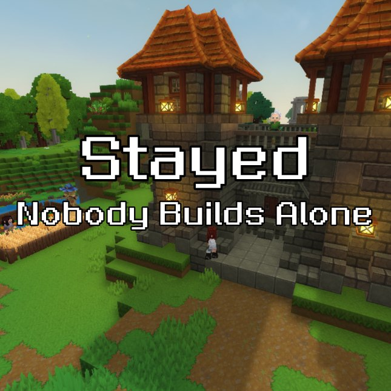

<p align="center">
  
</p>

<h1 align="center">Stayed</h1>

<p align="center">A Hytale mod.</p>

---

## Concept

You arrive in an untamed world. Near spawn you find an old elven sage — Aelin — who has spent his life studying the architecture and cultures of every race in Orbis. He is frail, cannot fight or mine, but he knows how to build. Together you found a village.

Villagers are not tools. They are survivors — refugees who lost their homes to The Shattering. They have names, professions, and daily lives. They go to work in the morning, eat lunch at the warehouse, return home at night, and open the door themselves on the way out.

## How to play

**1. Find Aelin** near spawn and press F to talk to him. Ask about starting a settlement — he will give you a Founding Stone.

**2. Place the Founding Stone** on flat ground. A ghost preview of the Town Hall appears. If you want a different location, break the stone to cancel. When you're happy with the placement, press F on the stone and confirm.

> Place the stone 1 block above the ground — the building floor sits one block up.

**3. Deposit resources** into the stone's container via the GUI, then press "Start Construction". Aelin walks to the site and builds block by block, consuming materials as he goes.

> Use `/hb fastbuild` or `/hb instabuild` to speed up construction during testing.

**4. Rescue survivors.** After the Town Hall is built, talk to Aelin — *"We need settlers"*. Follow the quest marker to find a trapped villager, press F to invite them, then lead them back to the village.

**5. Build more.** Two ways to get a building's anchor block: talk to Aelin → *"I want to build something"*, or open the **Founder's Almanac** (an item he gives you) and press "Get Anchor" in its building catalog. Recommended order: House → Farm → Warehouse → Woodcutter's Hut → Mine.

- **House** — a villager moves in and starts following a day schedule
- **Farm** — a farmer tills, waters, harvests and replants the actual crops on the plot
- **Woodcutter's Hut / Mine** — assign a worker who produces wood / stone and ore into the village warehouse
- **Warehouse** — the village's storage; villagers come here for lunch and dinner
- **Guard House** — a guard patrols the village perimeter along the roads
- **Forge / Sawmill / Tavern** — can be built and staffed; smithing, wood crafting and cooked meals come in a later update

**6. Watch your village live.** Press F on any villager to see their stats, or open the Almanac to see who is unhoused or going hungry. Villagers walk the roads Aelin lays between buildings, open doors and gates on the way, and keep working (and getting hungry) even while you're away — the village catches up on what it missed when you log back in.

**7. Repairs.** If a finished building gets damaged, press F on its anchor: the page lists exactly which blocks are missing, takes the materials and rebuilds it.

## Features

- Anchor block → ghost preview → block-by-block construction with resource consumption
- Ten buildings: Town Hall, House, Warehouse, Farm, Woodcutter's Hut, Mine, Sawmill, Forge, Guard House, Tavern
- Full building rotation based on the direction the player faces when placing the anchor
- Repairing a damaged building for the exact blocks it lost
- Elf sage with custom appearance, idle behavior, and branching dialogue
- Founder's Almanac: village overview, settler complaints, building catalog
- Villager daily schedule: work, eat, rest — walking the roads, opening doors and gates
- A farmer who works the real crops on the plot; a guard who patrols the road network
- Roads generated between buildings with A* and undone cleanly when a building goes
- Village simulation that keeps running while chunks are unloaded, and catches up on the time you were away
- Random villager appearance and names from curated archetype pools
- Village HUD with live resource counts
- NPC identity that survives chunk unloads and server restarts

## Building from source

Requires Java 25 (OpenJDK 25.0.2 or JetBrains Runtime 25).

```bash
./gradlew build        # compile check
./gradlew devServer    # start local dev server
```

On Windows use `gradlew.bat`.

`settings.gradle.kts` resolves the server API with `useVersion("latest")`. If the
published API is newer than the Hytale build you have installed, the compile
fails with a pile of `cannot find symbol` errors on engine classes — pin the
version to match your install.

## Project structure

```
src/main/java/dev/hearthbound/
  HearthboundPlugin.java       — plugin entry point
  village/                     — persistent data model (VillageData, VillagerData, BuildingRecord, BuildingType)
  building/                    — construction pipeline (ghost → site clear → block-by-block → repair → roads)
  npc/                         — NPC identity, persistence, schedules, appearance, work behaviors
  events/                      — event handlers (anchor placement, F-key, chunk load, village tick, join)
  ui/                          — UI pages, dialogs and HUD
  quest/                       — rescue quest
  util/                        — scheduler, item names, shared UI rows, logging layer (util/log)
  commands/                    — /hb dev commands
  test/                        — in-game integration test framework (/hb test)

src/main/resources/
  Common/UI/Custom/*.ui        — UI layouts (Hytale UI DSL, not JSON)
  Server/Prefabs/*.prefab.json — building blueprints from the Asset Editor
  Server/NPC/Roles/*.json      — NPC behavior trees
  Server/Item/                 — custom block, item and interaction definitions
  Server/Objective/            — rescue quest objectives and markers
  Server/Languages/en-US/      — all user-facing strings
```

Contributor-facing notes (doc index, architecture walkthrough, persistence rules)
live in [CLAUDE.md](CLAUDE.md); engine API patterns and gotchas in
[MEMORY.md](MEMORY.md).

## What's coming

- Sawmill — turn logs into planks, stairs and slabs
- Forge — smithing tools, weapons and armour from ore
- Tavern — cooked meals that lift the whole village's mood
- Second rescue quest
- Brickyard — clay and brick production
- Market — recruit villagers without questing
- Building leveling (prefabs up to lvl 3 already exist)

## License

MIT — see [LICENSE](LICENSE).
